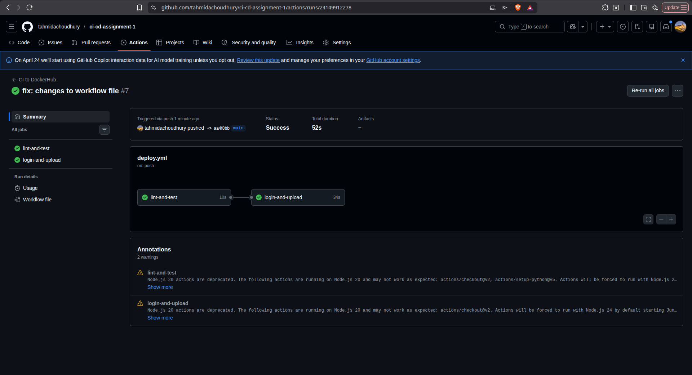
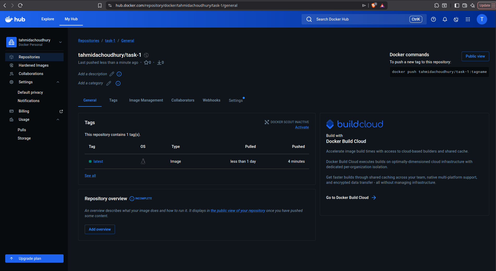
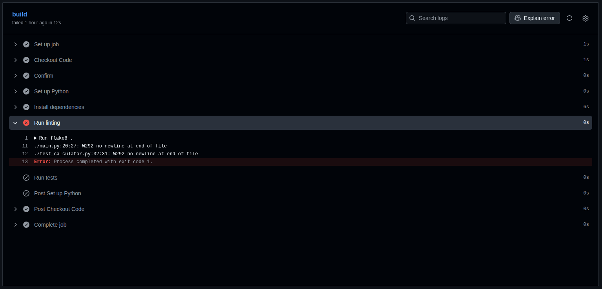
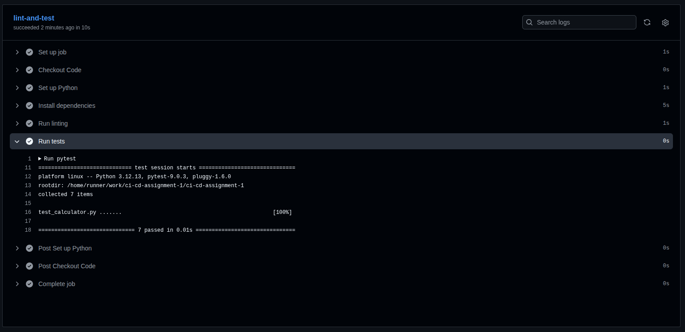

# Task 1 – Basic CI Pipeline

## What Was Built
A GitHub Actions CI pipeline that runs automatically on every push. The pipeline validates the code, builds a Docker image and pushes it to Docker Hub - all without any manual steps.

## Pipeline Steps
1. Checkout code from the repo
2. Login to Docker Hub using GitHub Secrets
3. Install and run flake8 linting to check code quality
4. Run unit tests to verify the app works
5. Build the Docker image
6. Push the image to Docker Hub
7. Notify on success

## Docker Integration
- The app is containerised using a Dockerfile
- The Docker image is built and pushed to Docker Hub as part of the pipeline
- Docker Hub credentials are stored securely using GitHub Secrets (`DOCKER_USERNAME` and `DOCKER_PASSWORD`)

## Problems I Faced

**Docker build not working**

The workflow job for the `docker build` could not find the `Dockerfile`. I was missing the `checkout code` step as github actions could not see my code.

## What I Learned
- How to set up a GitHub Actions CI pipeline from scratch
- How flake8 linting works and why code formatting matters
- How CI/CD automatically catches bugs before they go anywhere
- How to pass Docker Hub credentials securely using GitHub Secrets
- How file structure affects where commands look for files

## Evidence

### Pipeline passing

### DockerHub image pushed

### Python linter working as expected

### Tests automated through CI

